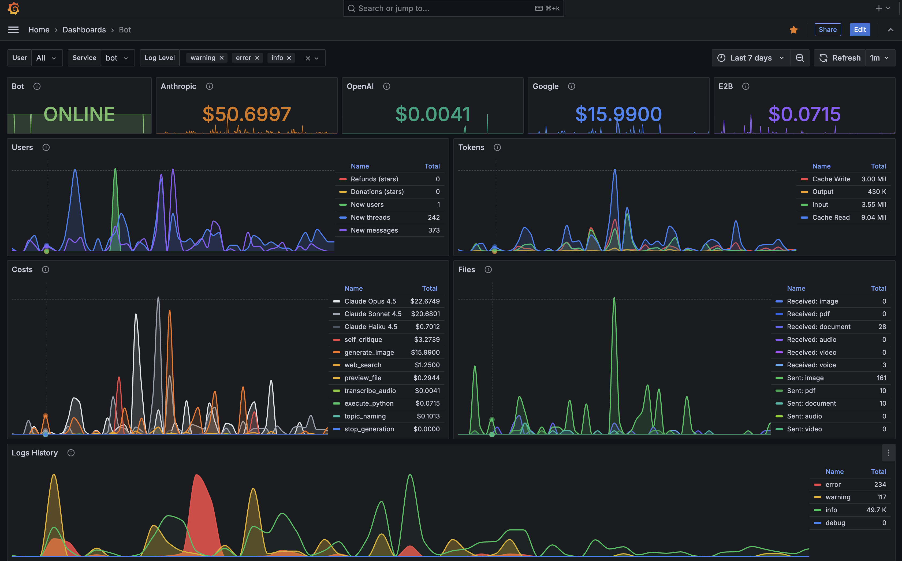

# Telegram LLM Bot

Telegram bot with access to LLM models (Claude, OpenAI, Google) and tools via agents.

## Quickstart

```bash
# 1. Clone repository
git clone git@github.com:trxxxxkov/chxxxxbot.git && cd chxxxxbot

# 2. Fill in required secrets
echo "YOUR_TELEGRAM_BOT_TOKEN" > secrets/telegram_bot_token.txt
echo "YOUR_ANTHROPIC_API_KEY" > secrets/anthropic_api_key.txt
echo "your_postgres_password" > secrets/postgres_password.txt
echo "your_redis_password" > secrets/redis_password.txt

# 3. Start (migrations run automatically)
docker compose up -d
```

Bot is ready. Web interfaces:
- Grafana: http://localhost:3000 (dashboards, logs)
- CloudBeaver: http://localhost:8978 (database UI)
- Redis Commander: http://localhost:8081 (cache UI)

Grafana comes with a pre-built dashboard for user activity analysis and log exploration:




### Import/Export Data

```bash
# Export database (full backup)
docker compose exec -T postgres pg_dump -U postgres postgres > backup.sql

# Import database (restore from backup)
cat backup.sql | docker compose exec -T postgres psql -U postgres
```

After importing an old backup, migrations auto-apply on next bot start.

---

## Working with the Project

### Start

```bash
# Start all containers
docker compose up -d

# Start with image rebuild
docker compose up -d --build

# Start specific service
docker compose up -d bot
docker compose up -d postgres
```

### Stop

```bash
# Stop all containers
docker compose down

# Stop with volume removal (CAUTION: deletes DB data)
docker compose down -v
```

### Restart

```bash
# Restart all containers
docker compose restart

# Restart specific service
docker compose restart bot

# Rebuild and restart bot
docker compose up -d --build bot
```

### Logs

```bash
# All logs
docker compose logs

# Real-time logs
docker compose logs -f

# Specific service logs
docker compose logs bot
docker compose logs postgres

# Last N lines
docker compose logs --tail=100 bot

# Logs with timestamps
docker compose logs -t bot
```

### Status

```bash
# List running containers
docker compose ps

# Resource usage
docker compose top
docker stats
```

### Debug

```bash
# Enter bot container
docker compose exec bot bash

# Enter PostgreSQL
docker compose exec postgres psql -U postgres

# Check environment variables
docker compose exec bot env
```

### Database

```bash
# Connect to PostgreSQL
docker compose exec postgres psql -U postgres -d postgres
```

For import/export, see [Quickstart](#importexport-data).

### Migrations (Alembic)

Migrations run automatically on bot startup. Manual commands:

```bash
# Create new migration (after changing models)
docker compose exec bot sh -c "cd /postgres && alembic revision --autogenerate -m 'description'"

# Apply migrations manually (usually not needed)
docker compose exec bot sh -c "cd /postgres && alembic upgrade head"

# Show current version
docker compose exec bot sh -c "cd /postgres && alembic current"
```

### Cleanup

```bash
# Remove stopped containers
docker compose rm

# Remove unused images
docker image prune

# Full Docker cleanup (CAUTION)
docker system prune -a
```

---

## Project Structure

See [CLAUDE.md](CLAUDE.md) for full architecture documentation.

```
├── bot/          # Telegram bot
├── postgres/     # PostgreSQL + migrations
├── grafana/      # Dashboards
├── loki/         # Logs
├── docs/         # Documentation
└── secrets/      # Tokens (not in git)
```

## Monitoring

| Service | URL | Purpose |
|---------|-----|---------|
| Grafana | http://localhost:3000 | Dashboards, logs, metrics |
| CloudBeaver | http://localhost:8978 | Database UI (SQL) |
| Redis Commander | http://localhost:8081 | Cache UI (Redis) |

## Secrets

Files in `secrets/` (empty templates in repo, fill with your values):

**Required:**
- `telegram_bot_token.txt` — Telegram Bot API token
- `anthropic_api_key.txt` — Claude API key
- `postgres_password.txt` — PostgreSQL password
- `redis_password.txt` — Redis password

**Optional:**
- `openai_api_key.txt` — OpenAI API key (for Whisper)
- `google_api_key.txt` — Google API key (for image generation)
- `e2b_api_key.txt` — E2B API key (for code execution)
- `grafana_password.txt` — Grafana admin password
- `privileged_users.txt` — Admin user IDs (one per line)

After filling in secrets:
```bash
git update-index --skip-worktree secrets/*
```

## Bot Commands

### User Commands

| Command | Description |
|---------|-------------|
| `/start` | Start the bot and get welcome message |
| `/help` | Show help information |
| `/model` | Select Claude model (Haiku, Sonnet, Opus) |
| `/balance` | View current balance and transaction history |
| `/pay` | Purchase balance with Telegram Stars |
| `/refund <transaction_id>` | Request refund (within 30 days) |
| `/paysupport` | Payment support information |

### Admin Commands (Privileged Users Only)

| Command | Description |
|---------|-------------|
| `/topup <user_id\|@username> <amount>` | Manually add balance to user account |
| `/set_margin <margin>` | Set owner margin (k3) for commission calculation |

**Privileged users** are configured in `secrets/privileged_users.txt` (one Telegram user ID per line).

### Payment System

**Balance System:**
- All users start with $0.10 balance
- Balance is used to pay for API calls (Claude, tools, external APIs)
- Soft balance check: requests allowed while balance > 0 (can go negative once)
- After balance ≤ 0, further requests are blocked until top-up

**Buying Balance:**
- Use `/pay` command to purchase Stars packages
- Available packages: 10, 50, 100, 250, 500 Stars
- Or enter custom amount (1-2500 Stars)
- Instant balance crediting after successful payment

**Commission Formula:**
```
y = x × (1 - k1 - k2 - k3)

where:
  x = stars_amount × $0.013 (nominal USD value)
  y = credited balance (after commissions)
  k1 = 0.35 (Telegram withdrawal fee)
  k2 = 0.15 (Topics in private chats fee)
  k3 = 0.0+ (Owner margin, configurable)
```

**Refunds:**
- Available within 30 days of payment
- User must have sufficient balance (≥ refund amount)
- Use transaction ID from payment confirmation
- Stars returned to user's Telegram account

**Cost Tracking:**
- Claude API: Input/output tokens, cache reads, thinking tokens
- Tools: Whisper transcription, E2B code execution, image generation
- All costs logged in balance_operations table
